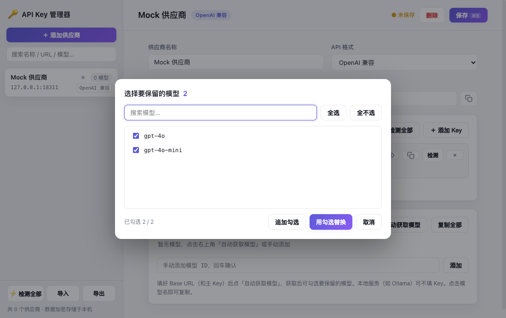
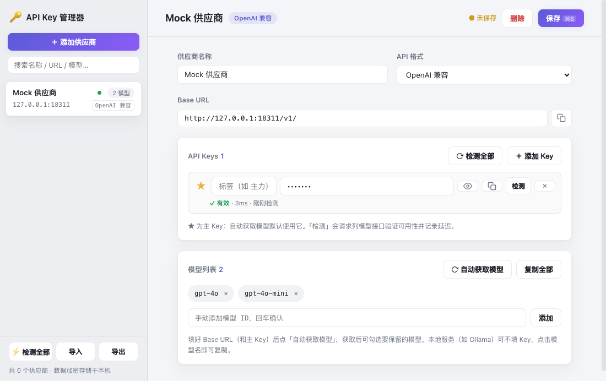

# API Key Manager

macOS 桌面应用：集中管理 AI 模型供应商的 API Key、Base URL 与模型列表。Electron 构建，数据全部加密存储在本机。



## 功能特性

- **多 Key 管理** — 同一供应商可挂多个 Key（标签、掩码显示、一键复制），★ 主 Key 用于自动拉取模型
- **健康检测** — 单个 / 供应商内 / 全部一键检测，显示 ✓ 有效 + 延迟 或 ✗ 失效 + 原因；侧栏健康点一眼看出失效 Key
- **自动获取模型** — 按 API 格式自动推导「列出模型」端点，拉取后**勾选保留**（搜索过滤、全选/全不选、替换或追加）
- **导入 / 导出** — 支持本应用 JSON（同名同 URL 自动合并 Key）、每行一条的文本 `名称, URL, Key`、`.env` 文件（`*_API_KEY` 与 `*_BASE_URL` 自动配对）；导出可选是否包含 Key
- **自动备份** — 每次保存前轮换保留最近 10 份数据快照
- **API 格式** — OpenAI 兼容 / Anthropic / Google Gemini，智能兼容带不带 `/v1` 的 Base URL



## 安全说明

- API Key 通过 Electron `safeStorage` 加密存储于 macOS 钥匙串体系，明文不落盘
- 数据文件位于 `~/Library/Application Support/API Key Manager/providers.json`，**不在本仓库内**
- 仓库不含任何真实 Key，测试使用本地 mock 服务器与 `sk-test` 假 Key

## 跨平台（Windows / Linux）

应用本身基于 Electron，Windows / Linux 开箱即用（快捷键为 `Ctrl+S`）：

```bash
# Windows 上构建（PowerShell）
git clone https://github.com/Handsonmac/api-key-manager.git
cd api-key-manager
npm install
npm run pack          # 产出 dist\API Key Manager-win32-x64\API Key Manager.exe

# Linux 上构建
npm run pack          # 产出 dist/API Key Manager-linux-x64/
```

在 macOS 上可以交叉打包 Linux（`npm run pack:linux`）；交叉打包 **Windows 必须先安装 Wine**（electron-packager 会无条件把版本信息写进 exe 元数据），未安装时 `pack:win` 会快速失败并提示——**正式的 Windows 版请直接在 Windows 上原生打包**（见上方步骤）。

**跨机器迁移数据（重要）**：API Key 在 macOS 用 Keychain、Windows 用 DPAPI 加密，**直接拷贝 `providers.json` 到另一台机器会全部提示"Key 无法解密"**。正确做法：

1. 旧机器：侧栏「导出」→ 勾选 **包含 API Key（明文）** → 保存 JSON
2. 通过安全渠道把 JSON 传到新机器（注意这是明文 Key，传输后建议删除）
3. 新机器：侧栏「导入」→ 选择该 JSON → 自动合并并**用本机加密体系重新加密存储**

## 开发

```bash
npm install          # Electron 40.10.2（见下方备注）
npm start            # 启动开发实例
npm test             # 单元测试（数据迁移 / 导入解析 / 模型获取）
npm run test:e2e     # 端到端测试（CDP 驱动真实应用，含 mock 服务器）
npm run pack         # 打包当前平台到 dist/（自动选择 icns/ico/png 图标）
npm run pack:win     # 交叉打包 Windows
npm run pack:linux   # 交叉打包 Linux
```

> 备注：本项目在 Electron 40.10.2 上开发，`npm install` 若因网络拉不下新版 Electron，可手动解压缓存中的 v40 zip 到 `node_modules/electron/dist/`。

## 技术栈

纯 Electron + 原生 JS（无前端框架），渲染层约 1000 行：

```
main.js            主进程：IPC（加载/保存/检测/导入/导出）、safeStorage 加密、自动备份
preload.js         contextBridge 暴露 API
renderer/          界面（侧栏列表 + 编辑器 + 弹层）
lib/fetch-models.js  三种格式的模型拉取与健康检测
lib/model.js       数据模型纯函数（多 Key 规范化、旧数据迁移、备份轮换）
lib/import.js      导入解析与合并（零依赖，渲染层/主进程共用）
test/              单元测试 + mock 服务器 + CDP 端到端
```

## License

MIT

## 🔗 友链

- [LinuxDo](https://linux.do) — 高质量的Linux中文社区
